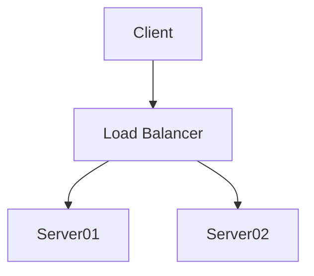

# MinhasHoras API Documentation

## Commands

* `mkdocs serve` - Start the live-reloading docs server.
* `mkdocs build` - Build the documentation site.
* `mkdocs -h` - Print help message and exit.

## Project layout

    mkdocs.yml    # The configuration file.
    docs/
        index.md  # The documentation homepage.
        ...       # Other markdown pages, images and other files.

## Mermaid Diagrams
### General Principle
In order to insert a Mermaid diagram in a markdown page, simply 
type it using the mermaid syntax,
and surround it with the code fence for Mermaid:


    ```mermaid
    graph TD
    A[Client] --> B[Load Balancer]
    B --> C[Server01]
    B --> D[Server02]
    ```
That will result in this:



### How to write Mermaid diagrams

* For instructions on how to make a diagram, see [the official website](https://mermaid.js.org).
* If you are not familiar, see the [Mermaid Overview for Beginners](https://mermaid.js.org/community/n00b-overview.html).
* In case of doubt, you will want to test your diagrams in the [Mermaid Live Editor](https://mermaid.live).