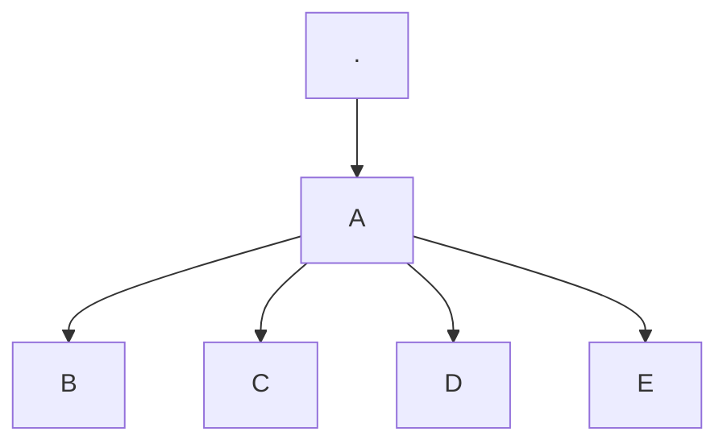

# Examples of using Mkdocs features

## Macros
Testing use of macros in markdown files:
{{ group_test.test_macro }}

## Templates


## Mermaid Diagrams

## emojis
:smile: :+1: :tada: :rocket: :metal: 🤖
