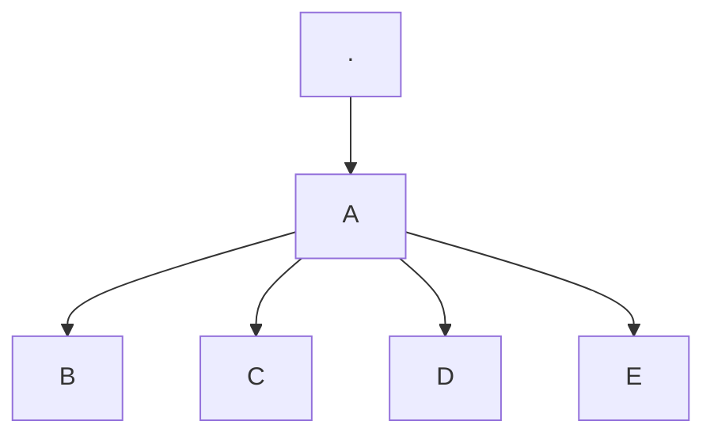

# Examples of using Mkdocs features

## Macros
Testing use of macros in markdown files:
{{ group_test.test_macro }}

## Templates


## Mermaid Diagrams

## emojis
:smile: :+1: :tada: :rocket: :metal: 🤖

## Task list
- [ ] Task 1
- [ ] Task 2
- [ ] Task 3
- [ ] Task 4

## Warning box
!!! warning "Warning title"
	Warning text goes here. Just a example of a warning box.
    Lorem ipsum dolor sit amet, consectetur adipiscing elit. Nullam auctor, nisl nec ultricies lacinia, nisl nisl aliquet nunc, eget aliquam nis

## Note box
!!! note "Note title"
	Note text goes here. Just a example of a warning box.
    Lorem ipsum dolor sit amet, consectetur adipiscing elit. Nullam auctor, nisl nec ultricies lacinia, nisl nisl aliquet nunc, eget aliquam nis

## Tip box
!!! tip "Tip title"
	Tip text goes here. Just a example of a warning box.
    Lorem ipsum dolor sit amet, consectetur adipiscing elit. Nullam auctor, nisl nec ultricies lacinia, nisl nisl aliquet nunc, eget aliquam nis

## Danger box
!!! danger "Danger title"
	Tip text goes here. Just a example of a warning box.
    Lorem ipsum dolor sit amet, consectetur adipiscing elit. Nullam auctor, nisl nec ultricies lacinia, nisl nisl aliquet nunc, eget aliquam nis
