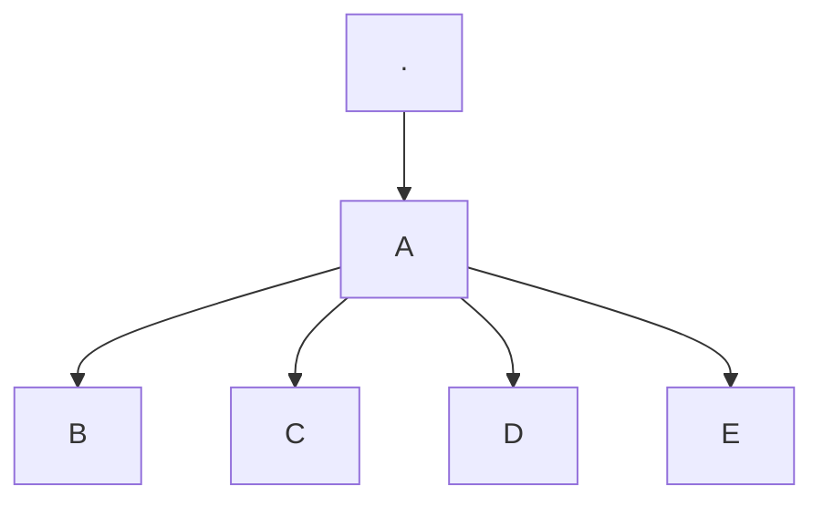

# Examples of using Mkdocs features


## Heading
Notation:
```md
# H1
## H2
### H3
#### H4
```
## Bold
Notation:
```md
**bold text**
```
Result:
**bold text**

## Italic
Notation:
```md
*italicized text*
```
Result:
*italicized text*

## Blockquote
Notation:
```md
> blockquote some text
```
Result:
> blockquote some text


## Ordered List
Notation:
```md
1. First item
2. Second item
3. Third item
```
Result:

1. First item
2. Second item
3. Third item

## Unordered List
Notation:
```md
- First item
- Second item
- Third item
```
Result:

- First item
- Second item
- Third item

## Code
Notation:
```md
`this is a line of code`
```
Result:

`this is a line of code`

## Horizontal Rule
Notation:
```md
---
```
Result:

---

## Link
Notation:
```md
[Markdown Guide](https://www.markdownguide.org)
```
Result:

[Markdown Guide](https://www.markdownguide.org)

## Image
Notation:
```md

```
Result:


## Table
Notation:
```md
| Syntax    | Description |
|-----------|-------------|
| Header    | Title       |
| Paragraph | Text        |
```
Result:

| Syntax    | Description |
|-----------|-------------|
| Header    | Title       |
| Paragraph | Text        |

## Fenced Code Block
Notation:
````md
```
{
  "firstName": "John",
  "lastName": "Smith",
  "age": 25
}
```
````
Result:
```
{
  "firstName": "John",
  "lastName": "Smith",
  "age": 25
}
```

## Definition List
Notation:
```md
term
: definition

```
Result:

term
: definition

## Strikethrough
Notation:
```md
~~The world is flat.~~
```
Result:

~~The world is flat.~~

## Highlight
Notation:
```md
I need to highlight these ==very important words==.
```
Result:

I need to highlight these ==very important words==.

## Subscript
Notation:
```md
H~2~O
```
Result:

H~2~O

## Superscript
Notation:
```md
X^2^
```
Result:

X^2^

## Mermaid Diagrams
Notation:
````md



````

Result:


## emojis
Notation:
```md
:smile: :+1: :tada: :rocket: :metal: 🤖
```
Result:

:smile: :+1: :tada: :rocket: :metal: 🤖

## Task list
Notation:
```md
- [ ] Task 1
- [ ] Task 2
- [ ] Task 3
- [ ] Task 4
```

Result:

- [ ] Task 1
- [ ] Task 2
- [ ] Task 3
- [ ] Task 4


## Warning box
Notation:
```md
!!! warning "Warning title"
	Warning text goes here. Just an example of a warning box.
    One more line of text.
    Another line of text.
```

Result:

!!! warning "Warning title"
	Warning text goes here. Just an example of a warning box.
    One more line of text.
    Another line of text.

## Note box
Notation:
```md
!!! note "Note title"
	Note text goes here. Just an example of a warning box.
    One more line of text.
    Another line of text.
```

Result:

!!! note "Note title"
	Note text goes here. Just an example of a warning box.
    One more line of text.
    Another line of text.

## Tip box
Notation:
```md
!!! tip "Tip title"
	Tip text goes here. Just an example of a warning box.
    One more line of text.
    Another line of text.
```

Result:

!!! tip "Tip title"
	Tip text goes here. Just an example of a warning box.
    One more line of text.
    Another line of text.

## Danger box
Notation:
```md
!!! danger "Danger title"
	Tip text goes here. Just an example of a warning box.
    One more line of text.
    Another line of text.
```

Result:

!!! danger "Danger title"
	Tip text goes here. Just an example of a warning box.
    One more line of text.
    Another line of text.

## Macros
Testing use of macros in markdown files:
{{ group_test.test_macro }}

## Templates

